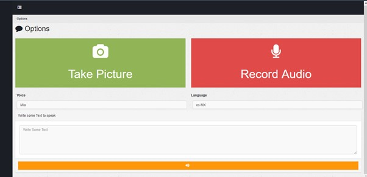

# HelpMePls
 Help Me Pls es una aplicación web que ayuda a personas que viajan a ciudades donde las personas solo hablan en su idioma nativo y las señales en las calles son confusas y, de igual forma, en el idioma que se habla allí para comunicarse y desenvolverse de mejor manera. Mediante las distintas herramientas que provee AWS el usuario será capaz de movilizarse con más confianza en la ciudad que visite y tener una mejor experiencia.

## Manual de Usuario

### Pantalla Principal
La pantalla principal de Help Me Pls se ve de la siguiente manera:
 
Una interfaz simple donde están claramente las funciones. 

### Take a Picture
Este botón desplegará un modal al cual deberá otorgarle permisos para acceder a la cámara para que esta pueda utilizarse.
 

Usted podrá tomar una captura y al dar al botón verde de la cámara. Al momento de tomar la foto, aparecerá un botón en la parte inferior de la ventana.
 

Antes de presionar el botón de translate, debe elegir el idioma de origen y el idioma de destino al cual quiere traducir.
- El botón amarillo le servirá para tomar una nueva foto, si la que ha tomado no le convence.
- El botón de cancelar, cerrará el modal.

Al presionar el botón de Translate, deberá esperar unos segundos, y la ventana desaparecerá, mostrando la traducción en la pantalla principal en el apartado de "Result"
 

### Record
El botón de Record, le permitirá grabar un audio y enviarlo para que este sea traducido dependiendo los idiomas que usted escoja. 
 

Para comenzar a grabar, deberá presionar el botón rojo de la pantalla.
 

Y para detener la grabación, deberá volver a presionar el botón
 

Esto generará una muestra del audio antes de enviarlo, puede volver a generarlo si presiona de nuevo el botón de grabar. 

Para traducir el texto, deberá presionar el botón de Translate, y esperar a que el resultado aparezca en la misma sección que la respuesta de la fotografía
 

### Reply with Audio
Si usted desea contestar a una persona que habla en diferente idioma, con audio, podrá escribir en la sección de texto, lo que usted quiera decir a otra persona.
 

Deberá escoger la voz con la que desea traducir y el idioma de destino para posteriormente presionar el botón anaranjado, el cual reproducirá el audio con la voz de su texto traducido.

